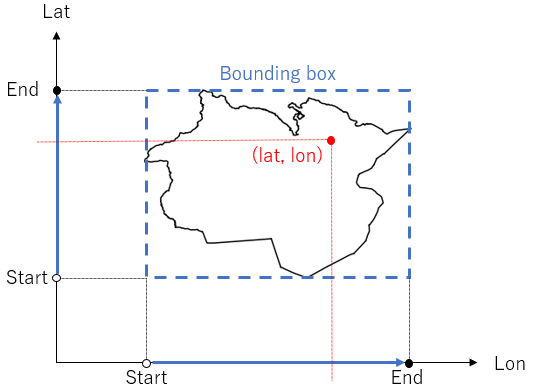

# Reverse Geocoder with OSM data
This notebook(ReverseGeocoder.ipynb) is to build reverse geocoder, which responses location address name from latitude and longitude that a user requests. Source of the geolocation data comes from OpenStreetMap.

**NOTE**: This script was tested with only OSM Japan and Kanto regions data.

Here are rough steps
1. Download and decompress OSM file of a region
2. Extract shape data of all administrative boundaries from OSM file, such as prefecture, city, town, and so on.
3. Create bounding box data per administrative boundary, and make 2 sorted lists of all bounding boxes. One is sorted by latitude and the other is by longitude. If a user requests with latitude and longitude, it retrieves matching boxes by latitude and longitude seperately, and intersects the result sets as candidates for the next step.

4. Create line list consisting per administrative boundary, and sort the list by latitude. Each line is a vector from Node\[i\] to Node\[i+1\]. This is used to judge if a line is right or left side against latitude & longitude user inputs. First it retrieves all lines covering user's latitude. Then it calculates cross of 2 vectors per line. One vector is from user's latitude & longitude to start point of the line (=Node\[i\]), the other is from user's latitude & longitude to the other end point(=Node\[i+1\]). If value of the cross is positive, the line is on the right from user's latitude & longitude. Otherwise it's on the left.

Then imagine holizontal line from user's latitude and longitude to infinity, and count the intersections of the lines consisting of the boundary. If the number is odd, the requested location is inside of the boundary. Otherwise it's outside.

